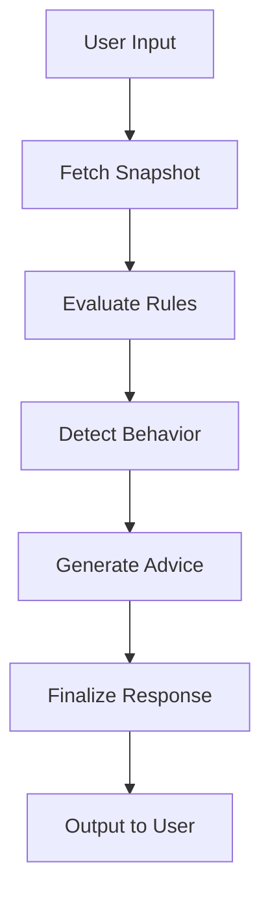

# Financial Coaching Agent - LangGraph

A production-ready autonomous financial coaching agent built with LangGraph and LangChain. This agent orchestrates multiple external APIs to provide personalized financial advice.

## 🏗️ Architecture

This LangGraph project focuses on **orchestration only** - it does not contain business logic. Instead, it:

1. Calls external APIs as tools
2. Orchestrates reasoning using LangGraph state management
3. Generates final user-friendly advice

### Workflow

```
User Input → Snapshot API → Rule Engine API → Behavior Detection API (Optional) → Advice API → Final Output
```

### External APIs

- **User Snapshot API**: `GET /api/user/snapshot/{user_id}`
- **Rule Engine API**: `POST /api/rule-engine/evaluate`
- **Behavior Detection API**: `POST /api/behavior/detect` (Optional)
- **Advice Generator API**: `POST /api/advice/generate`

## 📁 Project Structure

```
finMentor_Agent/
│
├── app/
│   ├── __init__.py
│   ├── main.py                 # Entry point for demo
│   ├── graph.py                # LangGraph workflow definition
│   ├── state.py                # Pydantic state schemas
│   ├── config.py               # Configuration management
│   │
│   ├── tools/                  # External API wrappers
│   │   ├── __init__.py
│   │   ├── snapshot_tool.py
│   │   ├── rule_engine_tool.py
│   │   ├── advice_tool.py
│   │   └── behavior_tool.py
│   │
│   ├── agents/                 # Agent orchestrators
│   │   ├── __init__.py
│   │   └── financial_agent.py
│   │
│   └── utils/                  # Utility modules
│       ├── logger.py
│       └── http_client.py
│
├── .env.example                # Environment variables template
├── .gitignore
├── requirements.txt            # Python dependencies
└── README.md
```

## 🚀 Getting Started

### Prerequisites

- Python 3.10 or higher
- pip or poetry for package management
- External APIs running (or use mock endpoints)

### Installation

1. **Clone the repository** (if not already done):
   ```bash
   git clone <your-repo-url>
   cd finMentor_Agent
   ```

2. **Create a virtual environment**:
   ```bash
   python -m venv .venv
   ```

3. **Activate the virtual environment**:
   
   **Windows (PowerShell)**:
   ```powershell
   .\.venv\Scripts\Activate.ps1
   ```
   
   **Windows (CMD)**:
   ```cmd
   .venv\Scripts\activate.bat
   ```
   
   **Linux/Mac**:
   ```bash
   source .venv/bin/activate
   ```

4. **Install dependencies**:
   ```bash
   pip install -r requirements.txt
   ```

5. **Configure environment variables**:
   ```bash
   # Copy the example environment file
   cp .env.example .env
   
   # Edit .env with your API keys and endpoints
   ```

### Environment Configuration

Edit `.env` with your settings:

```env
# LLM Configuration
LLM_PROVIDER=openai              # or 'gemini'
OPENAI_API_KEY=your_key_here
GOOGLE_API_KEY=your_key_here
OPENAI_MODEL=gpt-4o-mini
GEMINI_MODEL=gemini-1.5-flash

# External API URLs (update with your actual endpoints)
USER_SNAPSHOT_API_URL=http://localhost:8000/api/user/snapshot
RULE_ENGINE_API_URL=http://localhost:8000/api/rule-engine/evaluate
ADVICE_GENERATOR_API_URL=http://localhost:8000/api/advice/generate
BEHAVIOR_DETECTION_API_URL=http://localhost:8000/api/behavior/detect

# Feature Flags
ENABLE_BEHAVIOR_DETECTION=true

# Logging
LOG_LEVEL=INFO
```

## 🎮 Usage

### Running the Demo

Run the interactive demo from the terminal:

```bash
python -m app.main
```

Or:

```bash
python app/main.py
```

### Example Interaction

```
======================================================================
🤖 Financial Coaching Agent - Demo
======================================================================

📋 Configuration:
   LLM Provider: openai
   Behavior Detection: Enabled
   Log Level: INFO

👤 Enter User ID (or press Enter for demo user '12345'): 12345

💬 Enter your financial question (optional, press Enter to skip): How can I reduce my debt?

🔄 Processing your request...

🎯 Financial Coaching Report for User: 12345
============================================================

📊 Financial Snapshot:
  - Income: $75000
  - Expenses: $45000
  - Savings: $30000
  - Debt: $15000

⚠️  Rules Triggered (2):
  - [HIGH] Debt-to-income ratio exceeds 40%
  - [MEDIUM] Emergency fund below 3 months expenses

💡 Personalized Advice:
  Based on your current financial situation...

✅ Action Items:
  1. Reduce monthly expenses by 15%
  2. Allocate $500/month to emergency fund
  3. Pay off high-interest credit card debt first

============================================================
✅ Session completed successfully!
======================================================================
```

### Programmatic Usage

```python
import asyncio
from app.agents import FinancialAgent

async def run_agent():
    agent = FinancialAgent()
    
    result = await agent.run(
        user_id="12345",
        user_query="How should I allocate my savings?"
    )
    
    print(result.final_response)
    print(f"Action Items: {result.action_items}")

asyncio.run(run_agent())
```

## 🔧 Development

### Project Components

#### 1. **State Management** (`app/state.py`)
Defines the Pydantic schemas for:
- `FinancialAgentState`: Shared state across all graph nodes
- `AgentInput`: Input schema
- `AgentOutput`: Output schema

#### 2. **LangGraph Workflow** (`app/graph.py`)
Defines the sequential workflow:
- `fetch_snapshot_node`: Fetches user financial data
- `evaluate_rules_node`: Evaluates financial rules
- `detect_behavior_node`: Detects spending patterns (optional)
- `generate_advice_node`: Generates personalized advice
- `finalize_response_node`: Formats final output

#### 3. **API Tools** (`app/tools/`)
Each tool wraps an external API call:
- `snapshot_tool.py`: User Snapshot API
- `rule_engine_tool.py`: Rule Engine API
- `behavior_tool.py`: Behavior Detection API
- `advice_tool.py`: Advice Generator API

#### 4. **Agent Orchestrator** (`app/agents/financial_agent.py`)
Main class that:
- Initializes the LangGraph workflow
- Manages graph execution
- Handles errors gracefully

#### 5. **Utilities** (`app/utils/`)
- `logger.py`: Colored logging setup
- `http_client.py`: Async HTTP client for API calls

## 🧪 Testing

### Mock API Responses

Since the external APIs may not be available, the tools are designed to handle errors gracefully and return fallback responses.

To test with mock data:
1. Start your external API services
2. Update `.env` with correct URLs
3. Run the agent

Alternatively, modify the tool functions to return mock data for testing.

## 📊 State Flow



## 🛡️ Error Handling

- All API calls have error handling with fallback responses
- Errors are logged and tracked in the state
- The workflow continues even if optional nodes fail
- Final response includes warnings for any issues

## 🎯 Design Principles

1. **Separation of Concerns**: Business logic lives in external APIs
2. **Async First**: All I/O operations are async
3. **Type Safety**: Full Pydantic typing for all schemas
4. **Observability**: Comprehensive logging at each step
5. **Graceful Degradation**: Continues even if optional steps fail

## 🤝 Contributing

This is a hackathon project. Feel free to extend with:
- Additional tools/API integrations
- More sophisticated error handling
- LLM-based reasoning nodes
- Conditional branching in the graph

## 📝 License

MIT License - feel free to use for your projects!

## 🆘 Troubleshooting

### Import Errors
Make sure you've activated the virtual environment and installed dependencies:
```bash
.\.venv\Scripts\Activate.ps1
pip install -r requirements.txt
```

### API Connection Errors
Check that:
1. External API URLs in `.env` are correct
2. External APIs are running and accessible
3. Network connectivity is working

### LLM API Errors
Ensure:
1. API keys are set correctly in `.env`
2. You have quota/credits available
3. The model names are correct

## 🚀 Deployment

For production deployment:

1. Set up proper environment variables
2. Use a process manager (e.g., systemd, supervisor)
3. Configure logging to files
4. Add monitoring and alerting
5. Implement rate limiting for API calls
6. Add authentication/authorization

## 📞 Support

For issues or questions:
- Check logs for detailed error messages
- Verify all environment variables are set
- Ensure external APIs are accessible

---

**Built with ❤️ for MumbaHacks**
